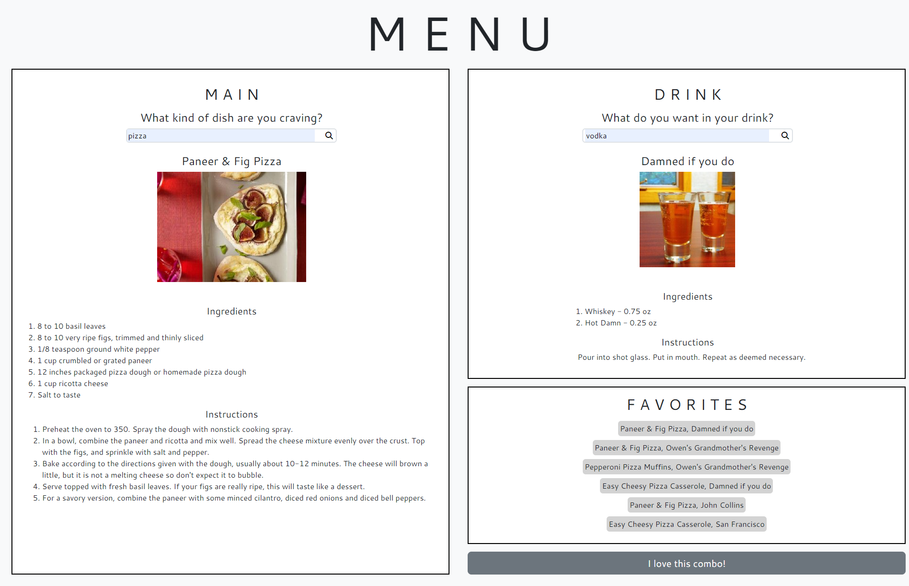

# A Night In

## Description

We wanted to create an application that allows users to find new and exciting recipes based on a desired meal and their favorite cocktail ingredients. Users can display recipe instructions and ingredients, as well as save their favorite combos to local storage to display at a later date. We learned how to parse information from multiple APIs to create custom Javascript functions and generate dynamic HTML elements based on API information.

## Installation

N/A

## Usage

1. Access the application at the following URL: https://agarfar.github.io/a-night-in/

2. If you are over 21 years of age, click the "Yes" button on the start page.

3. Input your desired main dish and favorite cocktail ingredient in the respective menu sections to display a random recipe for each item.

4. Click on "I love this combo!" to save the currently displayed recipes to the "Favorites" section.

5. Click any paired item in the "Favorites" section to generate the recipes' information back on the page.

## Credits

Risvi Tareq: https://github.com/ivsir

Anthony Farris: https://github.com/agarfar

Spoonacular: https://spoonacular.com/food-api

TheCocktailDB: https://www.thecocktaildb.com/api.php

## License

N/A